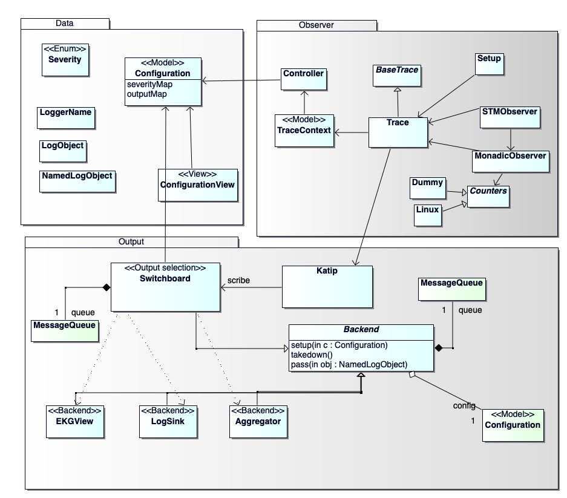
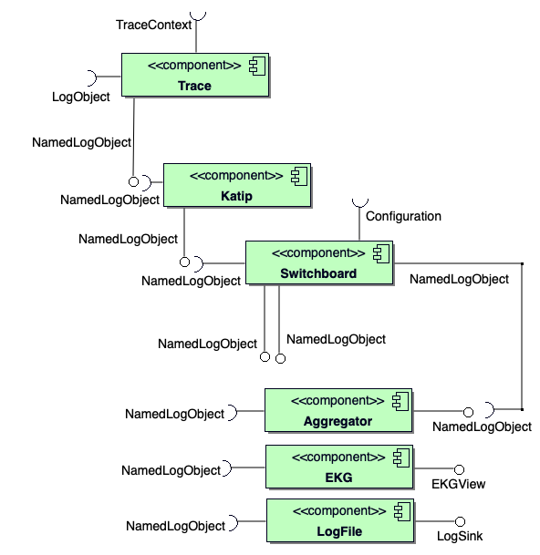

# Documentation

## UML Diagrams

Diagrams have been edited with [BOUML](https://bouml.fr), a light-weight and fast UML editor.
License: "free of use", no license.

## Overview modules

> `convert OverviewModules.png Relationships.pdf`

## Components

## STM observer

## Configuration

### configure output selection

### configure severity filter

### apply severity filter

## Backend state machine

## Integration in Cardano.Shell

